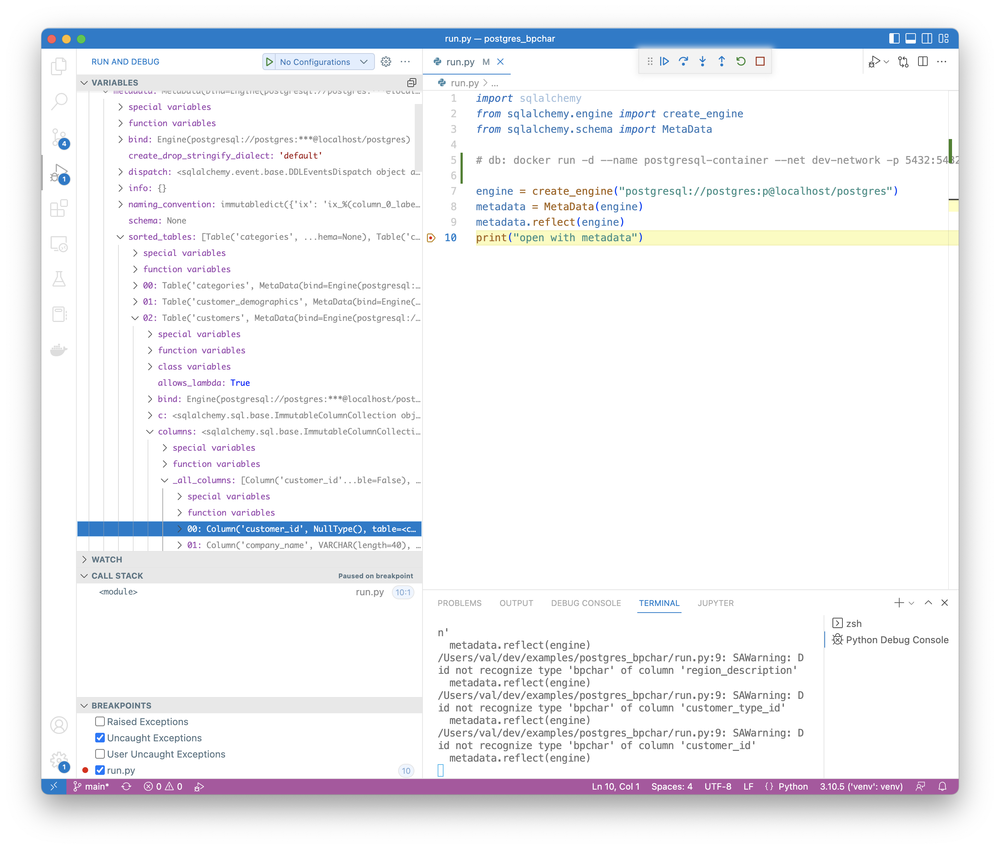

# Test Description


I have a postgres (PostgreSQL) 13.4 (Debian 13.4-1.pgdg100+1) database, running on Mac, under docker:

```
docker run -d --name postgresql-container --net dev-network -p 5432:5432 -e PGDATA=/pgdata -e POSTGRES_PASSWORD=p apilogicserver/postgres:version1.0.2
```

The following table uses `bpchar` for a datatype:

<figure></figure>

When running the `reflect` code under `SQLAlchemy==1.4.29`, I get the following console log:

```
/Users/val/dev/examples/postgres_bpchar/run.py:7: SAWarning: Did not recognize type 'bpchar' of column 'customer_id'
```

The metadata sees this as `nulltype`:

<figure></figure>

# Questions

My questions are:

1. Is `bpchar` supported in the postgres dialect?
   * I thought that the dialect was inferred from the uri `postgresql`.
   * I _no such module_ with `postgres+psycopg2`
2. If not, how can I recover the original type?

# Logged as

Issue is [logged here](https://github.com/sqlalchemy/sqlalchemy/discussions/8592).