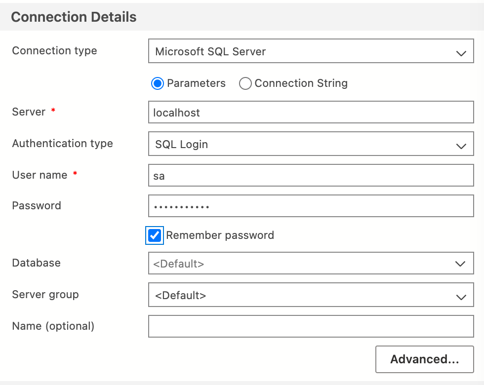

# Test Description


I have a SqlServer database, running on __M1__ Mac, under Docker:

```
docker run --name sqlsvr-container --net dev-network -p 1433:1433 -d apilogicserver/sqlsvr-m1:version1.0.0
```

<figure></figure>

I am able to configure:

<figure></figure>

and connect with Azure Data Studio:

<figure></figure>

I have installed the ODBC driver per [this doc](https://learn.microsoft.com/en-us/sql/connect/odbc/linux-mac/install-microsoft-odbc-driver-sql-server-macos?view=sql-server-ver16):

```bash
/bin/bash -c "$(curl -fsSL https://raw.githubusercontent.com/Homebrew/install/master/install.sh)"
brew tap microsoft/mssql-release https://github.com/Microsoft/homebrew-mssql-release
brew update
HOMEBREW_ACCEPT_EULA=Y brew install msodbcsql18 mssql-tools18
```

When running this app, the connect times out, I suspect due to odbc install/configure.


The issue is [logged here](https://github.com/sqlalchemy/sqlalchemy/discussions/8592).